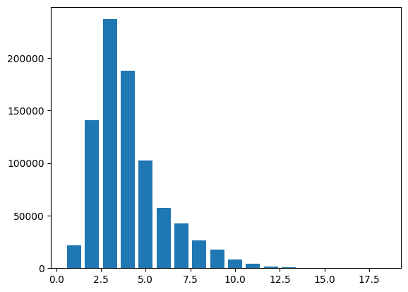
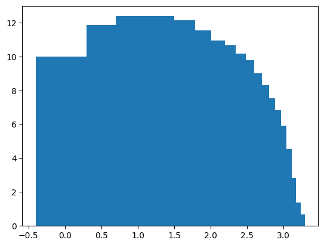

# Question 1
See code.

# Question 2
```
{1: 21802,
 2: 140510,
 3: 236833,
 4: 187942,
 5: 102128,
 6: 57480,
 7: 42796,
 8: 26457,
 9: 17777,
 10: 8104,
 11: 4010,
 12: 1845,
 13: 928,
 14: 367,
 15: 94,
 16: 17,
 17: 4,
 18: 2}
```

# Question 3
Words of length 1:
```
{'e', 'o', 's', 'h', 'a', 'c', 'l', 'b', 'i'}
```

Words of length 2:
```
{'hm', 'ur', 'ox', 'ca', 'in', 'do', 'is', 'we', 'ah', 'so', 'by',
'ho', 'il', 'if', 'me', 'be', 'my', 'us', 'he', 'ai', 'an', 'am',
'go', 'og', 'ay', 'to', 'at', 'lo', 'hi', 'as', 'on', 'it', 'or',
'ts', 'up', 'no', 'ar', 'wo', 'ir', 'uz', 'of', 'ut', 'un', 'co',
'ha', 'oh', 'er', 'ye', 'ed', 'pg'}
```

Words of length 3:
```
{'tug', 'ill', 'jaw', 'ant', 'cry', 'bat', 'sin', 'hot', 'uri',
'ziz', 'pit', 'hem', 'gad', 'bed', 'fan', 'ask', 'tin', 'all', 'rat',
'buy', 'sky', 'dip', 'axe', 'hoe', 'huz', 'ava', 'gur', 'owe', 'age',
'tie', 'irs', 'naw', 'toe', 'rib', 'out', 'hai', 'lod', 'led', 'put',
'ein', 'ono', 'rub', 'did', 'tra', 'six', 'zif', 'nor', 'pau', 'gog',
'sap', 'any', 'ere', 'jar', 'day', 'its', 'bul', 'gin', 'ink', 'dor',
'bit', 'low', 'jew', 'koa', 'ham', 'pin', 'law', 'eye', 'met', 'sue',
'ara', 'few', 'lop', 'koz', 'dig', 'hod', 'eli', 'lay', 'had', 'sur',
'dam', 'sit', 'hum', 'man', 'heh', 'yea', 'and', 'tob', 'cis', 'mao',
'evi', 'sum', 'nag', 'but', 'ton', 'yes', 'lip', 'lot', 'inn', 'hug',
'bud', 'got', 'ugh', 'kaa', 'see', 'now', 'wit', 'cow', 'fed', 'pet',
'pai', 'him', 'she', 'his', 'lud', 'fog', 'hip', 'grr', 'too', 'ehi',
'ali', 'iim', 'hew', 'hat', 'ran', 'woe', 'zin', 'ado', 'may', 'raw',
'die', 'pay', 'far', 'you', 'say', 'sod', 'owl', 'fit', 'odd', 'eri',
'toi', 'oar', 'nun', 'ray', 'pig', 'row', 'arm', 'key', 'wen', 'apt',
'abi', 'two', 'cat', 'fir', 'tip', 'den', 'sad', 'pua', 'nut', 'hut',
'not', 'lit', 'hur', 'nay', 'new', 'old', 'bag', 'dog', 'joy', 'egg',
'fly', 'rim', 'cor', 'the', 'wag', 'eve', 'ark', 'ear', 'son', 'ten',
'rob', 'vow', 'pur', 'sea', 'has', 'wet', 'thy', 'luz', 'web', 'fig',
'pen', 'jah', 'maw', 'gun', 'wow', 'bah', 'ner', 'fox', 'use', 'rot',
'bow', 'sup', 'oho', 'mud', 'cut', 'fee', 'fro', 'ice', 'ape', 'fun',
'are', 'ben', 'jig', 'sew', 'ewe', 'bay', 'aul', 'zur', 'kir', 'can',
'paw', 'hin', 'pan', 'sun', 'let', 'rip', 'wee', 'vex', 'cab', 'zer',
'eat', 'air', 'cod', 'dan', 'hsh', 'awe', 'fat', 'red', 'ash', 'won',
'pah', 'fix', 'fur', 'sir', 'iri', 'bee', 'why', 'wah', 'wig', 'run',
'bad', 'mar', 'bid', 'nob', 'guj', 'zia', 'rod', 'ate', 'yet', 'get',
'hul', 'jot', 'pul', 'iru', 'cub', 'bar', 'buz', 'non', 'god', 'dim',
'dry', 'lap', 'gay', 'nod', 'way', 'set', 'hah', 'sop', 'asa', 'act',
'beg', 'for', 'mad', 'ard', 'one', 'saw', 'oak', 'reu', 'hid', 'sia',
'cud', 'rag', 'kin', 'bel', 'hen', 'gob', 'men', 'rid', 'sow', 'noe',
'wax', 'yai', 'rei', 'hay', 'oil', 'nap', 'who', 'gap', 'sat', 'kid',
'war', 'ami', 'own', 'tax', 'err', 'due', 'top', 'lad', 'tow', 'ago',
'boy', 'aha', 'tou', 'try', 'sem', 'pad', 'rie', 'fin', 'uel', 'off',
'lid', 'oft', 'ass', 'coz', 'doe', 'mob', 'net', 'ira', 'ram', 'leg',
'big', 'log', 'was', 'cap', 'ahi', 'gat', 'pot', 'art', 'hor', 'rue',
'our', 'her', 'dew', 'add', 'end', 'how', 'asp', 'box', 'spy', 'job',
'wot', 'cup', 'lie', 'hap', 'win', 'hit', 'ain', 'roe', 'din'}
```

The 1-length words are mostly gibberish (except "I") and are probably one-offs in the dataset. Their frequency is relatively low, which supports this hypothesis.

The 2-length words are mostly funciton words (e.g. prepositions like "in," "by," articles like "an," pronouns like "me," "he," conjunctions like "if," "as," or interjections like "hm") or very common content words ("do", "go", "is").

The 3- and higher-length words are almost exclusively content words.

# Question 4
See Figure 1.



# Question 5
See Figure 2.



# Question 6
The Pearson's coefficient between the length and the frequency is $-0.8091937069744125$.

# Question 7
From the above, we see some evidence towards Zipf's Law, i.e., more common words tend to be shorter. However, this rule is far from universal, and is nothing more than a rough correlation – we see many extremely rare three-letter words, for instance.
This fact gives us more confidence in the thesis of the cited paper, which makes the claim that frequency is not the deciding factor, but *information content* – it is this attribute that is regulated across the lengths of words. However, our unigram-based context-independent study cannot give us any further leads on this claim.